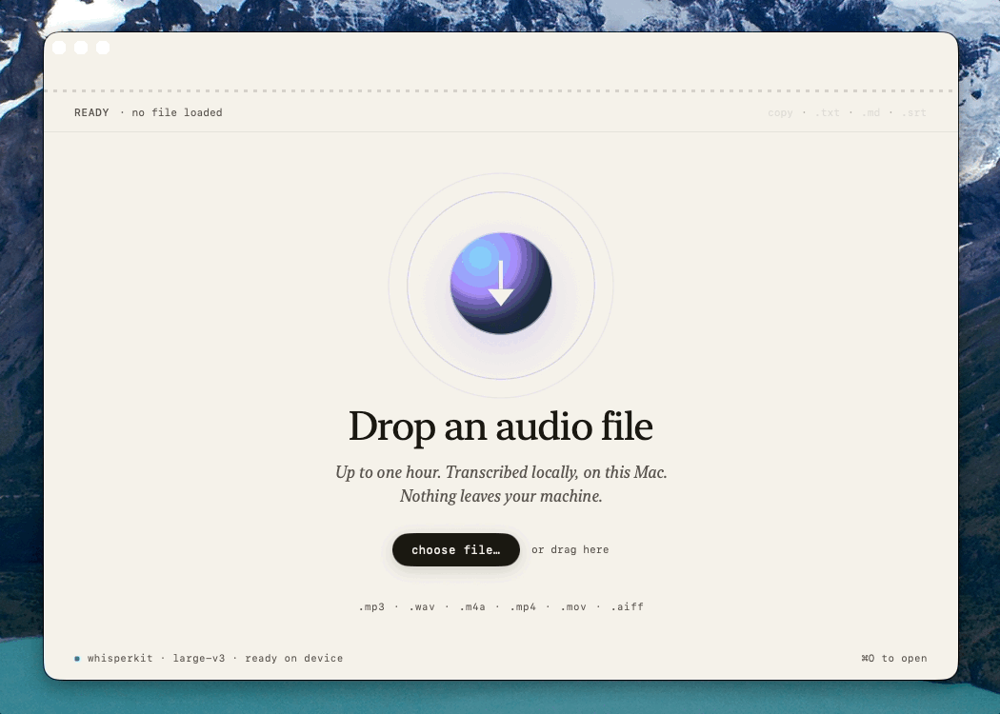
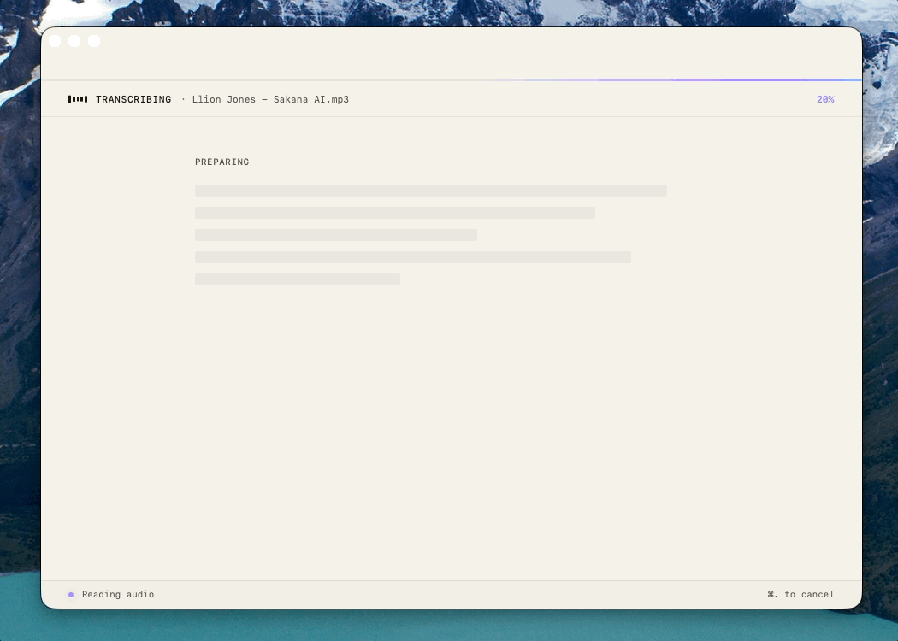

# Scribe

Private transcription for people who work with words.

Scribe is a local-first transcription app for Apple Silicon Macs. Drop in a voice memo, interview, lecture, or field recording and get back a readable transcript with paragraph breaks, sparse timestamps, click-to-seek playback, and export to `.txt`, `.md`, or `.srt`.

It is built for journalists, writers, researchers, founders, students, and anyone who works from recorded conversations. Audio never leaves your machine.

## Download

The simplest way to get Scribe is to download the latest `.dmg` from [Releases](https://github.com/Nuneybits/scribe/releases).

1. Download `Scribe.dmg`
2. Open it
3. Drag `Scribe.app` into the `Applications` folder
4. Open Scribe from `Applications`
5. If macOS blocks it, go to `System Settings > Privacy & Security` and click `Open Anyway`

Scribe downloads its local transcription model on first launch. After that, transcription runs entirely on your Mac.

## How It Works

Three states, no menus, no settings panel.

### Drop an audio file

The whole window is a drop target. Voice Memos, MP3, M4A, WAV, MP4, MOV, and AIFF all work. You can also press `⌘O` to pick a file the old-fashioned way.

### Watch it work

The top hairline turns into a slow cyan-to-violet sweep — that's WhisperKit running on the Neural Engine. Paragraphs stream into the window as they're decoded, with a soft caret marking where the model is right now.

### Read, skim, jump, export

When the transcript is ready, sparse timestamps appear in the gutter. Click any timestamp to seek playback to that moment. Copy to clipboard, or export as `.txt`, `.md`, or `.srt`.

## Why Scribe Exists

Recorded audio is where a lot of real work begins: interviews, lectures, meetings, voice memos, background calls, half-heard ideas, and the raw material of reporting.

Most transcription tools are either cloud-dependent, subscription-heavy, or overloaded with workflow features that get between you and the text. Scribe takes a narrower approach: one native macOS window, local transcription, clear playback, and clean export.

VoiceType is for what you say. Scribe is for what you hear.

## What's In The Box

- Local transcription on Apple Silicon Macs using WhisperKit
- Drag-and-drop intake for Voice Memos, MP3, M4A, WAV, MP4, MOV, AIFF
- Live draft preview while longer files are processed
- Readable paragraph grouping with sparse timestamps
- Click-to-seek transcript navigation
- Copy, `.txt`, `.md`, and `.srt` export
- No accounts, no telemetry, no cloud path

## Coming Soon

- Signed and notarized builds (no more Gatekeeper warning on first open)
- Speaker labels for interviews and multi-person recordings
- Searchable transcripts with fast jump-to-moment playback
- Quote and highlight workflows for reporters and writers
- Lightweight summaries that help you find the story without replacing the source
- A simple local library for past recordings and transcripts

## Privacy

Scribe is designed to keep transcription local on your machine. There are no accounts, no telemetry hooks, and no cloud transcription path in this repo. Your audio stays on your Mac.

Scribe needs file access for dropped or selected audio files, local disk access for the model cache and transcript exports, and audio playback through AVFoundation. Nothing else.

## Companion App

Scribe is the companion app to [VoiceType](https://github.com/Nuneybits/voicetype), a local dictation app for Mac.

VoiceType helps capture live thought. Scribe helps turn recorded audio into usable copy.

## Tech Stack

- Swift / SwiftUI
- AVFoundation
- [WhisperKit](https://github.com/argmaxinc/WhisperKit)
- Swift Package Manager

No Electron. No web view. No account required.

## Contributing

Contributions are welcome. If you want to propose a substantial change, please open an issue first so the direction stays coherent.

## License

[MIT](LICENSE)
