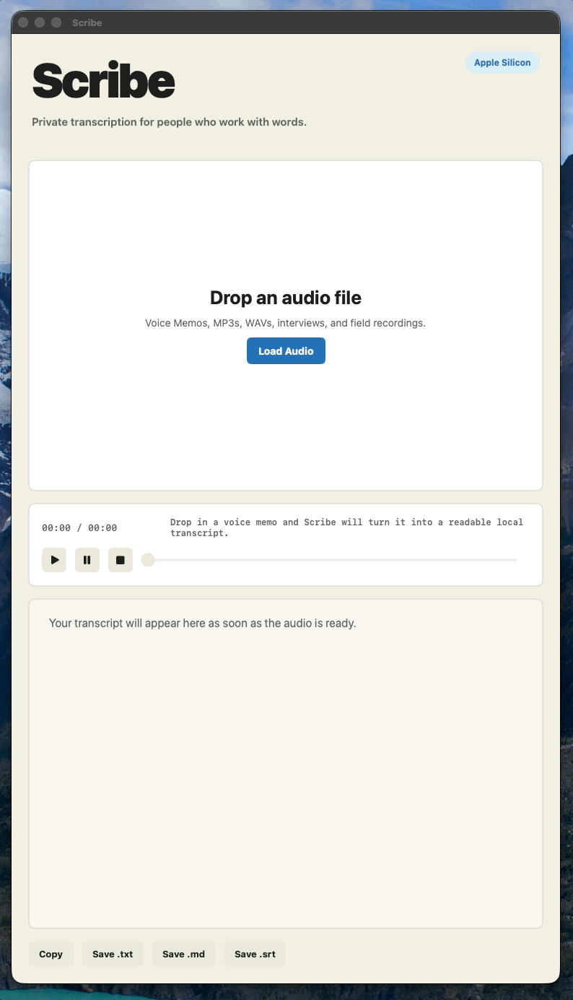
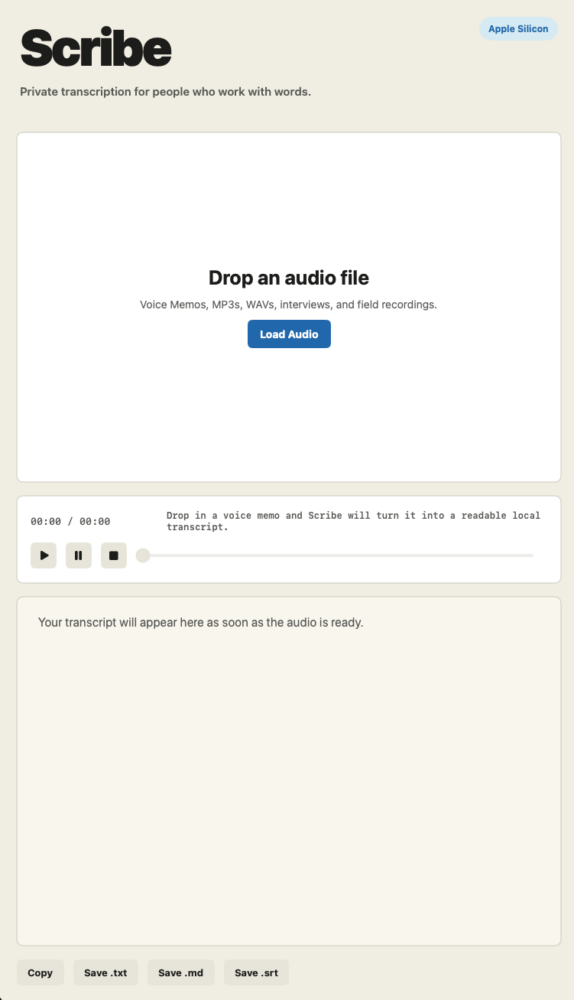
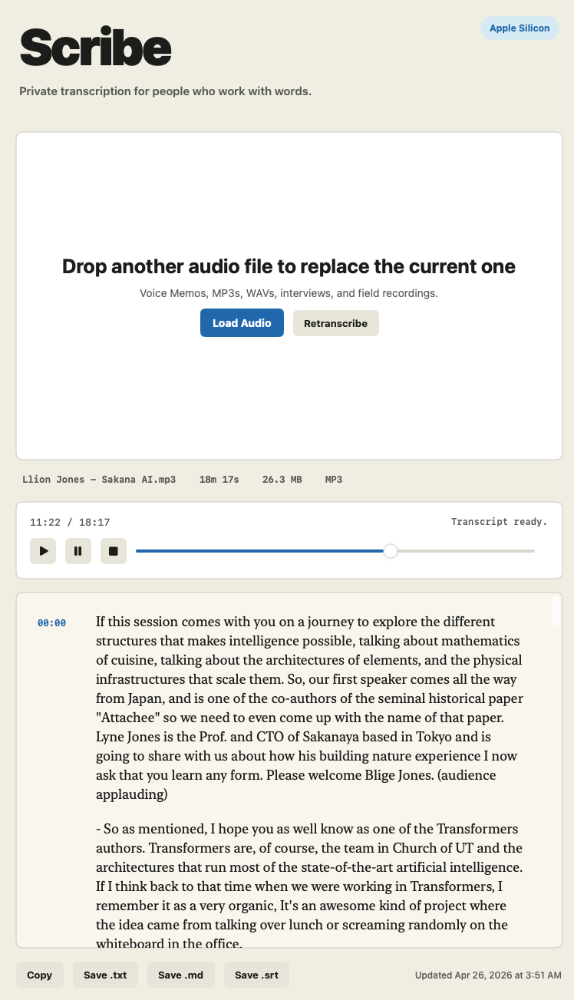

# Scribe

Private transcription for people who work with words.

Scribe is a local-first transcription app for Apple Silicon Macs. Drop in a voice memo, interview, lecture, or field recording and get back a readable transcript with paragraph breaks, sparse timestamps, click-to-seek playback, and export to `.txt`, `.md`, or `.srt`.

It is built for journalists, writers, researchers, founders, students, and anyone who works from recorded conversations.

## Highlights

- Local transcription on macOS with WhisperKit
- Built for interviews, voice memos, lectures, and rough field audio
- Drag-and-drop audio intake
- Live draft preview while longer files are processed
- Click-to-seek playback from transcript timestamps
- Timestamped export to `.txt`, `.md`, and `.srt`
- No accounts, no telemetry, no cloud transcription path

## Screenshots

### Drop an audio file

### Read, skim, play back, and export

## Download

The simplest way to get Scribe is to download the latest `.dmg` from GitHub Releases.

## Install Scribe

1. Download the latest `.dmg`
2. Open it
3. Drag `Scribe.app` into the `Applications` folder
4. Try opening Scribe from `Applications`
5. If macOS blocks it, go to `System Settings > Privacy & Security`
6. Click `Open Anyway`
7. Return to `Applications` and open Scribe again

Scribe downloads its local transcription model on first launch. After that, transcription runs locally on your Mac.

## Why Scribe Exists

Recorded audio is where a lot of real work begins: interviews, lectures, meetings, voice memos, background calls, half-heard ideas, and the raw material of reporting.

Most transcription tools are either cloud-dependent, subscription-heavy, or overloaded with workflow features that get between you and the text. Scribe takes a narrower approach: one native macOS window, local transcription, clear playback, and clean export.

VoiceType is for what you say. Scribe is for what you hear.

## What Ships In v0.1.0

Scribe currently includes:

- local transcription on Apple Silicon Macs using WhisperKit
- support for common audio and video files, including Voice Memos, MP3, M4A, WAV, MP4, and MOV
- a live draft preview for longer recordings
- readable paragraph grouping
- sparse timestamps in the transcript
- playback controls with a visible scrubber
- click-to-seek transcript navigation
- copy, `.txt`, `.md`, and `.srt` export
- a packaged macOS app and DMG build flow

## Coming Soon

Planned improvements include:

- signed and notarized builds for a smoother Mac install
- speaker labels for interviews and multi-person recordings
- searchable transcripts with fast jump-to-moment playback
- quote and highlight workflows for reporters, writers, and researchers
- lightweight summaries that help you find the story without replacing the source
- a simple local library for past recordings and transcripts
- stronger recovery for interrupted transcription jobs

## How To Use Scribe

Scribe is meant to be straightforward.

1. Launch Scribe.
2. Drop in an audio file or click `Load Audio`.
3. Wait while Scribe prepares the local model on first use.
4. Follow the live draft preview while the transcript is built.
5. Read the finished transcript.
6. Click a timestamp to jump playback.
7. Copy the transcript or export it as `.txt`, `.md`, or `.srt`.

## Privacy

Scribe is designed to keep transcription local on your machine. There are no accounts, no telemetry hooks, and no cloud transcription path in this repo.

Your audio stays on your Mac.

## Companion App

Scribe is the companion app to [VoiceType](https://github.com/Nuneybits/voicetype), a local dictation app for Mac.

VoiceType helps capture live thought. Scribe helps turn recorded audio into usable copy.

## Permissions

Scribe needs:

- file access for dropped or selected audio files
- local disk access for the model cache and transcript exports
- audio playback through AVFoundation

## Product Scope

Scribe `v0.1.x` is a focused local transcription tool.

It does **not** yet try to summarize, rewrite, diarize, quote-extract, or manage a library of past recordings. Those are useful ideas, but this first version is built around a simpler promise: drop audio in, get readable text out, keep the process private.

## Tech Stack

- Swift / SwiftUI
- AVFoundation
- [WhisperKit](https://github.com/argmaxinc/WhisperKit)
- Swift Package Manager

No Electron. No web view. No account required.

## Contributing

Contributions are welcome. If you want to propose a substantial change, please open an issue first so the direction stays coherent.

## License

[MIT](LICENSE)
